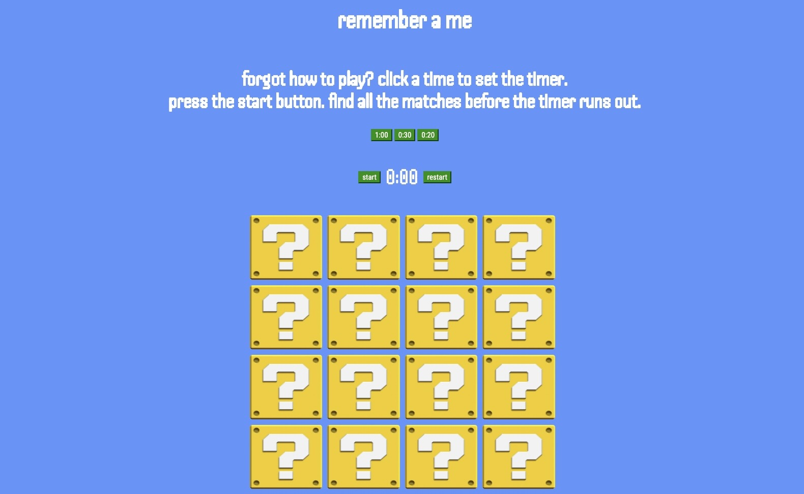
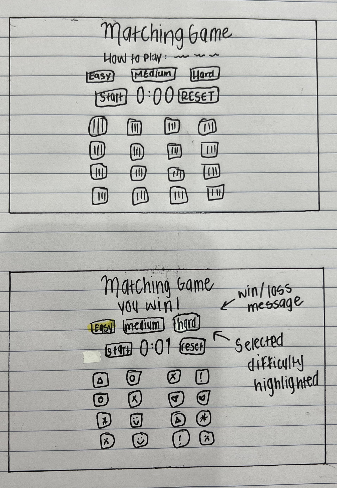

# Remember A Me
### https://rudisiona.github.io/matchinggame/

## Description
"Remember A Me" is a simple single player matching game, that features Super Mario Power-Ups to help you strengthen your memory. With 3 difficulty levels, the player can test their speed and practice getting faster. The player must find all matches before the time runs out to win.

## Technologies Used
- HTML5
- CSS3
- JavaScript
  
## Planning
### Wire Frames 

### Trello
https://trello.com/b/SFbDCj28/matchinggame

## Next Steps
I would like to increase the difficulty on the harder levels to make the game more interesting. I can do this by flipping the card over faster when it isn't a pair, swapping the position of cards when player is checking a match and it isn't a pair, or also adding a condition of a limited amount of guesses.
